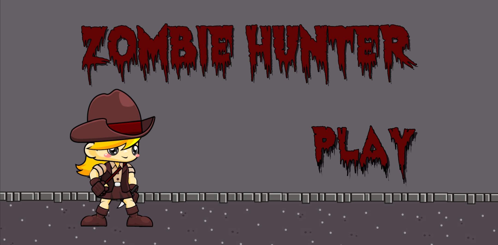
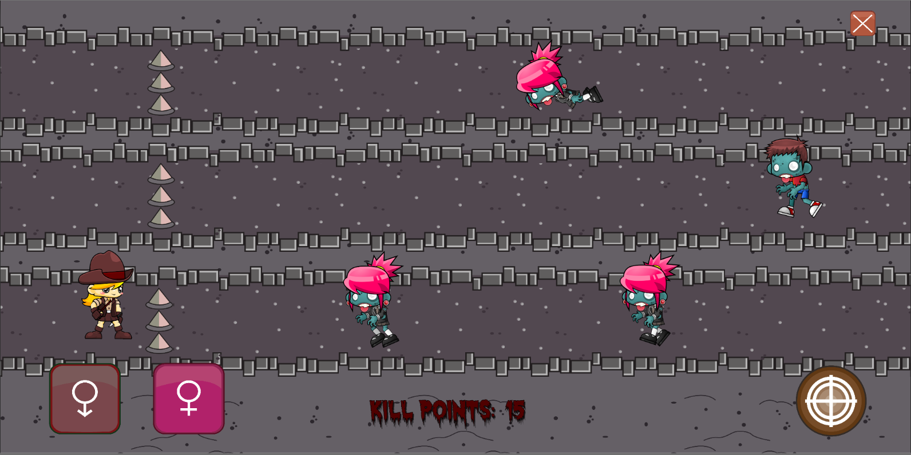
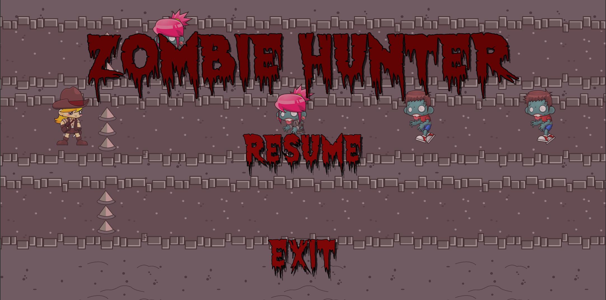

# Unity-2D-Zombie-Hunter

The Name of this game is Zombie Hunter. It’s a lane based never ending Zombie shooter, where there are 3 lanes and 2 types of zombie. The zombies are spawned randomly in any if the 3 lanes with randomized type. The players aim is the stop the zombies to hit the line of defense. The spawn rate for the Zombies increase as the player accumulates more time

### Target Platfrom.
The game is meant to be played on Mobile platform.

### Software Used.
* Unity3D.
* Adobe Photoshop cc.

### Free assets used from.
* Zombie [https://www.gameart2d.com/the-zombies-free-sprites.html]
* Player [https://www.gameart2d.com/adventurer-girl---free-sprites.html]

### Future Improvements.
* Civilians - npcs that u dont have to shoot.
* Big Zombies - Zombies that a bigger and hard to kill.
* Special Powers - Some Powers that have different effects.

# Screenshots.

